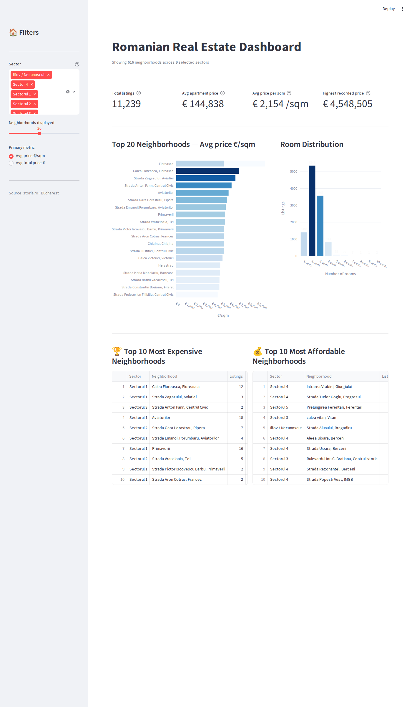

# 🏠 Romanian Real Estate Data Pipeline

<p align="center">
  
  
  
  
  
  
</p>

<p align="center">
  A fully containerized, end-to-end data engineering pipeline that scrapes <strong>11,000+ real estate listings</strong> from the Romanian property market (Bucharest), processes them through a <strong>Medallion Architecture</strong> (Bronze → Silver → Gold) using <strong>PySpark in local mode</strong>, and produces analytics-ready aggregations — all runnable with a single Docker command.
</p>

---

## 📊 Dashboard Preview



> Interactive Streamlit dashboard — KPI cards, top neighborhoods by price per m², room distribution, and Top 10 most expensive / most affordable neighborhoods.

---

## 📐 Architecture Overview

```
┌──────────────────────────────────────────────────────────────────────────────┐
│                    Fully Local · Fully Containerized                          │
└──────────────────────────────────────────────────────────────────────────────┘

  [storia.ro]
      │
      │  HTTP GET · BeautifulSoup · __NEXT_DATA__ parsing
      ▼
┌─────────────────────────────────────────────────────┐
│               🐳 Docker Compose                     │
│                                                     │
│  ┌──────────────────────────────────────────────┐   │
│  │          🥉 scraper service                  │   │
│  │                                              │   │
│  │  · Paginated scraping (100 pages)            │   │
│  │  · MD5 deterministic PK                      │   │
│  │  · Incremental upsert (URL key)              │   │
│  │  · 3-level rooms fallback                    │   │
│  │  · UTC timestamp per record                  │   │
│  │                                              │   │
│  │  Output → data/raw/storia_raw_data.json      │   │
│  └──────────────────────┬───────────────────────┘   │
│                         │ shared volume             │
│  ┌──────────────────────▼───────────────────────┐   │
│  │          🥈 transform service  (PySpark)     │   │
│  │                                              │   │
│  │  · Price  → Price_EUR (INT)                  │   │
│  │  · Area   → Area_sqm  (DOUBLE)               │   │
│  │  · Price/m² computed metric                  │   │
│  │  · Rooms  → INT                              │   │
│  │  · City_Sector extracted (regex)             │   │
│  │  · Neighborhood cleaned                      │   │
│  │                                              │   │
│  │  Output → data/silver_storia/  (Parquet)     │   │
│  └──────────────────────┬───────────────────────┘   │
│                         │ shared volume             │
│  ┌──────────────────────▼───────────────────────┐   │
│  │          🥇 gold service  (PySpark SQL)      │   │
│  │                                              │   │
│  │  · Avg price by sector                       │   │
│  │  · Avg €/m² by neighborhood                  │   │
│  │  · Listing count aggregations                │   │
│  │  · Filter: ≥ 2 listings per zone             │   │
│  │                                              │   │
│  │  Output → data/gold/   (Parquet + CSV)       │   │
│  └──────────────────────────────────────────────┘   │
│                                                     │
└─────────────────────────────────────────────────────┘
```

---

## 🛠️ Tech Stack

| Layer | Tool / Library | Purpose |
|-------|---------------|---------|
| **Ingestion** | `requests` + `BeautifulSoup4` | HTTP scraping with polite random delays |
| **Parsing** | `__NEXT_DATA__` JSON + HTML fallback | Robust room & metadata extraction |
| **Bronze Storage** | `pandas` → CSV + JSON | Local landing zone & upsert logic |
| **Silver / Gold** | PySpark `local[*]` | Type casting, enrichment, SQL aggregations |
| **Output format** | Parquet (Silver/Gold) + CSV (Gold) | Columnar storage + human-readable export |
| **Containerization** | Docker + Docker Compose | Reproducible pipeline — zero local setup |
| **Orchestration** | Apache Airflow 3.0 + DockerOperator | DAG-based scheduling with task dependencies |
| **Automation** | Bash + Linux cron | Daily unattended pipeline execution |
| **Visualization** | Streamlit + Plotly | Interactive analytics dashboard |
| **Testing** | pytest + PySpark integration tests | 8 tests covering all Silver transformations |
| **CI/CD** | GitHub Actions | Automated test runs on every push |
| **Config & Secrets** | `python-dotenv` | Environment variable management |
| **Language** | Python 3.12 | Pipeline orchestration |

---

## 📊 Dataset Snapshot

> Data sourced from [storia.ro](https://www.storia.ro) — Bucharest apartment listings (sale market).

| Metric | Value |
|--------|-------|
| **Total records** | 3,700+ listings |
| **Source pages scraped** | 100 pages |
| **Average asking price** | ~146,000 € |
| **Price range** | 19,000 € – 4,500,000 € |
| **Most common listing** | 2-room apartments (47%) |
| **Data freshness** | UTC timestamp per record |
| **Null rooms** | < 0.1% (2 records) |

---

## 🔁 Pipeline Stages

### 🥉 Bronze — Raw Ingestion (`imobiliare_scraper.py`)

The scraper targets apartment listings in Bucharest and handles all real-world messiness of a Next.js-rendered website:

- **Pagination** across 100 pages with polite random delays (2–4s)
- **`__NEXT_DATA__`** parsing for `roomsNumber` — the only reliable source across all pages
- **3-level fallback** for rooms: `__NEXT_DATA__` → title regex → full-text regex
- **Bulletproof location targeting**: positive match on `"bucure"` / `"ilfov"` strings, then aggressive negative filtering to eliminate UI noise (prices, timestamps, agency names)
- **Deterministic MD5 primary key** generated from the listing URL — stateless and reproducible
- **Incremental upsert**: re-runs deduplicate on URL, appending only new listings
- **Pandas `keep_default_na=False`** fix — prevents `"N/A"` strings from becoming `NaN` silently

**Output schema:**

| Field | Type | Description |
|-------|------|-------------|
| `listing_id` | `string` | MD5 hash of URL (primary key) |
| `scraped_at` | `ISO 8601` | UTC timestamp of scrape |
| `source` | `string` | `storia.ro` |
| `title` | `string` | Full listing title |
| `price` | `string` | Asking price in EUR (raw) |
| `area` | `string` | Property area in m² (raw) |
| `rooms` | `string` | Number of rooms (raw) |
| `location` | `string` | Neighborhood / sector (raw) |
| `url` | `string` | Direct link to listing |

---

### 🥈 Silver — Cleaned & Typed (`01_Bronze_to_Silver.py`)

PySpark script running in `local[*]` mode — uses all available CPU cores on the host machine:

- `price` → `Price_EUR (INT)` via `regexp_replace` + `try_cast` (graceful on malformed data)
- `area` → `Area_sqm (DOUBLE)` via `regexp_extract`
- `Price_per_sqm (DOUBLE)` — computed metric, rounded to 2 decimals
- `rooms` → `rooms (INT)` via `regexp_extract`
- `City_Sector` — extracted with regex `sector(?:ul)?\s*[1-6]`, null-safe
- `Neighborhood` — sector and city name stripped, trimmed cleanly
- **Architectural decision:** null rows are *retained* in Silver — dropping them would corrupt Gold-layer totals (e.g. "total market value"). Null handling is delegated to Gold queries
- Saved as **Parquet** — columnar, compressed, optimized for analytical queries
- Spark shuffle partitions set to `8` — right-sized for the host CPU (i5-10300H, 8 logical cores); default 200 would create 192 empty Parquet files

---

### 🥇 Gold — Business Aggregations (`02_Silver_to_Gold.py`)

PySpark SQL aggregation layer producing three independent analytical tables:

| Table | Description | Filter |
|-------|-------------|--------|
| `by_neighborhood` | Avg price, avg €/m², listing count — grouped by sector + neighborhood | `≥ 2 listings`, ordered by €/m² desc |
| `rooms_distribution` | Avg price and count per room type | All rooms, ordered ascending |
| `market_summary` | Single-row global market snapshot — total listings, min/max/avg price | Full dataset |

Each table is saved as both **Parquet** (programmatic consumption) and a **single-file CSV** (ready for Excel / BI tools).

---

## 🖥️ Running Modes

This pipeline supports two deployment configurations depending on your infrastructure:

| Mode | Storage | Processing | How to run |
|------|---------|------------|------------|
| **Local** | `data/` folder (shared Docker volume) | PySpark `local[*]` inside Docker | `docker compose up` |
| **Cloud** | Azure Blob Storage (`azure_uploader.py`) | Databricks cluster (notebooks) | Configure `.env`, run `azure_uploader.py` then open notebooks |

The **local mode** is fully self-contained — no cloud credentials required.
The **cloud mode** reflects the original production setup and requires an Azure Storage account and a Databricks workspace.

---

## 📁 Project Structure

```
real-estate-data-pipeline/
├── .github/
│   └── workflows/
│       └── ci.yml                  # CI/CD — runs pytest on every push
├── src/
│   ├── ingestion/
│   │   └── imobiliare_scraper.py   # Bronze: scrape, parse & incremental upsert
│   ├── pipeline/
│   │   ├── 01_Bronze_to_Silver.py  # Silver: PySpark type-cast & location enrichment
│   │   └── 02_Silver_to_Gold.py    # Gold:   PySpark SQL aggregations (3 tables)
│   ├── cloud/
│   │   └── azure_uploader.py       # Cloud mode: upload Bronze data to Azure Blob
│   ├── utils/
│   │   └── fix_null_rooms.py       # One-off null repair utility
│   └── config.py                   # Centralized paths & constants
├── tests/
│   └── test_silver_pipeline.py     # 8 integration tests — real SparkSession, no mocks
├── dags/
│   └── real_estate_dag.py          # Airflow DAG: scrape → silver → gold via DockerOperator
├── databricks_notebooks/           # Reference: original Databricks implementation
│   ├── 01_Bronze_to_Silver.ipynb
│   └── 02_Silver_to_Gold.ipynb
├── dashboards/
│   └── app.py                      # Streamlit dashboard — price analytics & charts
├── data/                           # Generated — gitignored
│   ├── raw/                        # Bronze: JSON + CSV
│   ├── silver_storia/              # Silver: Parquet
│   └── gold/                       # Gold:   Parquet + CSV (3 tables)
├── conftest.py                     # pytest root configuration
├── run_pipeline.sh                 # Bash runner — executes full pipeline, used by cron
├── .env.example                    # Environment variable template (safe to commit)
├── Dockerfile                      # Python 3.12 + Java 21 + PySpark dependencies
├── Dockerfile.airflow              # Airflow 3.0 image with DockerOperator provider
├── docker-compose.yml              # Three-stage pipeline: scraper → transform → gold
├── docker-compose.airflow.yml      # Airflow standalone stack with Docker socket access
├── requirements.txt
└── README.md
```

---

## 🚀 Getting Started

The only requirement is **Docker Desktop** (or Docker Engine on Linux).

### 1. Clone

```bash
git clone https://github.com/Bahna-Darius/real-estate-data-pipeline.git
cd real-estate-data-pipeline
```

### 2. Build the image

```bash
docker compose build
```

### 3. Run the pipeline — stage by stage

```bash
# Stage 1 — Scrape Bronze layer (storia.ro → data/raw/)
docker compose run scraper

# Stage 2 — Transform to Silver (raw JSON → data/silver_storia/ Parquet)
docker compose run transform

# Stage 3 — Aggregate to Gold (Silver → data/gold/ Parquet + CSV)
docker compose run gold
```

All output lands in `./data/` on your local machine via the shared Docker volume.

### 4. Run locally (without Docker)

```bash
pip install -r requirements.txt

python src/ingestion/imobiliare_scraper.py
python src/pipeline/01_Bronze_to_Silver.py
python src/pipeline/02_Silver_to_Gold.py
```

### 5. Automated daily runs (Linux cron)

`run_pipeline.sh` orchestrates all three stages and writes timestamped logs to `logs/`.
To schedule it daily at 14:00, add this entry via `crontab -e`:

```
0 14 * * * /path/to/real-estate-data-pipeline/run_pipeline.sh
```

Each stage runs in an isolated container that is automatically removed on completion (`--rm`),
leaving zero background processes between runs.

### 6. Launch the Streamlit dashboard

```bash
pip install -r requirements.txt
streamlit run dashboards/app.py
```

Requires Gold data to be present in `data/gold/`. Run the pipeline at least once first.

---

## 🧠 Key Engineering Decisions

**Fully containerized — zero local setup**
The entire pipeline (scraper + PySpark JVM) runs inside a single Docker image. Anyone can clone and run with `docker compose run scraper` — no Python version conflicts, no Java installation, no venv setup.

**PySpark local mode over a managed cluster**
For a dataset of ~3,700 rows, a full Spark cluster would be wasteful. `local[*]` mode utilizes all CPU cores on the host machine while keeping the architecture identical to what would run on a real cluster — making it trivially portable to Databricks, EMR, or Dataproc later.

**Shuffle partitions tuned to hardware**
PySpark defaults to 200 shuffle partitions. On a 3,700-row dataset this creates 192+ empty Parquet part-files. Setting `spark.sql.shuffle.partitions=8` (matching the 8 logical cores of the host CPU) right-sizes the output and dramatically reduces I/O overhead.

**Incremental load over full refresh**
URL-based deduplication ensures repeated runs only append genuinely new listings — no wasted scraping, no duplicate records.

**Deterministic MD5 primary keys**
Hashing the listing URL produces stable, reproducible IDs without a database sequence — making the pipeline stateless and testable.

**Nulls retained in Silver**
Dropping null rows at the Silver layer would silently corrupt Gold aggregations (e.g., average price calculations would exclude valid listings that simply have no sector data). Null handling is a Gold-layer concern, applied per query via `coalesce`.

**Parquet for Silver, Parquet + CSV for Gold**
Silver is consumed programmatically — Parquet's columnar compression makes it ideal. Gold is the final reporting layer — adding a single-file CSV export makes it immediately shareable without any tooling.

---

## 🗺️ Roadmap

- [x] Bronze layer scraper with incremental upsert
- [x] Silver layer — PySpark local: type casting, null cleanup, sector/neighborhood extraction
- [x] Gold layer — PySpark SQL: aggregated market analytics
- [x] Docker + Docker Compose — fully containerized, zero-setup pipeline
- [x] Robust rooms extraction with 3-level fallback
- [x] 📊 Streamlit dashboard — price trends, sector breakdown, room distribution
- [x] 🧪 pytest integration tests — 8 tests, real SparkSession, zero mocks
- [x] ⚙️ GitHub Actions CI/CD — automated test runs on push
- [x] 🌀 Apache Airflow DAG — DockerOperator, scrape → silver → gold task chain
- [x] ⏰ Automated daily runs — Bash runner + Linux cron, self-cleaning containers
