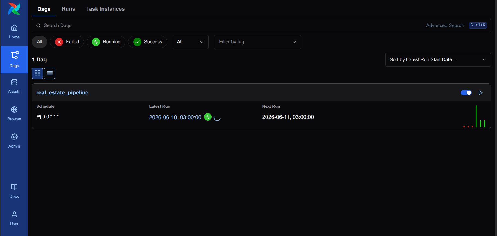
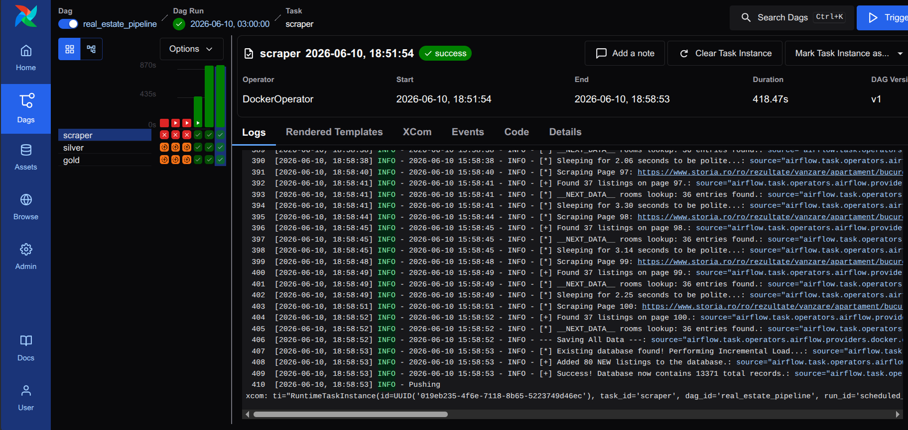
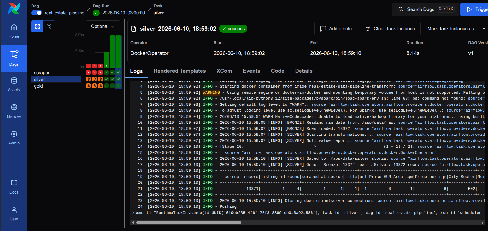

# Apache Airflow — Pipeline Orchestration

This document covers the Airflow setup for the Real Estate Data Pipeline: what it does, how to start it, and how it relates to the rest of the project.

---

## What Airflow Does Here

Airflow is an **orchestration layer** — it does not run the pipeline code directly. Instead, it schedules and monitors Docker containers that run each pipeline stage.

```
Airflow Scheduler
    │
    ├── Task: scraper  →  docker run real-estate-data-pipeline-scraper
    ├── Task: silver   →  docker run real-estate-data-pipeline-transform
    └── Task: gold     →  docker run real-estate-data-pipeline-gold
```

Each task is a `DockerOperator` — Airflow launches a container, waits for it to finish, and only triggers the next task if the previous one succeeded.

---

## Airflow vs Cron — Two Orchestration Approaches

This project has two independent ways to run the pipeline:

| | Cron + `run_pipeline.sh` | Apache Airflow |
|--|--|--|
| Setup | Single command | Docker container |
| UI | None — logs only | Web UI at `localhost:8080` |
| Retry on failure | No | Configurable |
| Task visibility | Log file | Per-task logs, history, status |
| Production-like | Basic | Yes |

**Cron is the default** for daily unattended runs. Airflow is the **production-grade alternative** — used when you need visibility, retry logic, and a monitoring interface.

---

## DAG Structure — `real_estate_dag.py`

```python
scrape >> silver >> gold
```

Three tasks in sequence. Each task is a `DockerOperator`:

```python
scrape = DockerOperator(
    task_id="scraper",
    image="real-estate-data-pipeline-scraper",
    command="python src/ingestion/imobiliare_scraper.py",
    mounts=[DATA_MOUNT],
)

silver = DockerOperator(
    task_id="silver",
    image="real-estate-data-pipeline-transform",
    command="python src/pipeline/01_Bronze_to_Silver.py",
    mounts=[DATA_MOUNT],
)

gold = DockerOperator(
    task_id="gold",
    image="real-estate-data-pipeline-gold",
    command="python src/pipeline/02_Silver_to_Gold.py",
    mounts=[DATA_MOUNT],
)
```

**Schedule:** `@daily` — runs once per day at midnight UTC.

**`DATA_MOUNT`** — a bind mount that maps `./data/` on the host into `/app/data` inside each container. This is how the scraper's output (Bronze) reaches the Silver container, and Silver's output reaches Gold — they all share the same `data/` folder on disk.

---

## Prerequisites

Before starting Airflow, the pipeline Docker images must be built:

```bash
docker compose -f docker-compose.yml build
```

This builds the three images Airflow will launch as containers:
- `real-estate-data-pipeline-scraper`
- `real-estate-data-pipeline-transform`
- `real-estate-data-pipeline-gold`

---

## Starting Airflow

```bash
docker compose -f docker-compose.airflow.yml up
```

Wait for this line in the logs:
```
standalone | Airflow is ready
```

Then open: **http://localhost:8080**

| Field | Value |
|-------|-------|
| Username | `admin` |
| Password | `admin` |

To stop Airflow:
```bash
docker compose -f docker-compose.airflow.yml down
```

---

## Triggering the DAG Manually

The DAG runs automatically on schedule. To trigger it manually:

1. Open **http://localhost:8080**
2. Find `real_estate_pipeline` in the DAG list
3. Click the **▷ (Play)** button on the right
4. Confirm the trigger

Or via CLI:
```bash
docker exec real-estate-data-pipeline-airflow-1 airflow dags trigger real_estate_pipeline
```

---

## Verified Run — Screenshots

### DAG List



The `real_estate_pipeline` DAG is active with `@daily` schedule (`0 0 * * *`). The run history bars on the right show successful (green) and in-progress runs.

---

### Scraper Task — SUCCESS



- **Operator:** DockerOperator
- **Duration:** ~418 seconds (~7 minutes)
- **Logs:** 100 pages scraped from storia.ro, incremental upsert performed

The logs panel shows real-time output from inside the Docker container — same output as running the scraper manually.

---

### Silver Task — SUCCESS



- **Operator:** DockerOperator
- **Duration:** 8.14 seconds
- **Logs:** PySpark Bronze → Silver transformation, Parquet written to `data/silver_storia/`

Silver runs only after the scraper container exits with code 0. If the scraper fails, Silver and Gold are never triggered.

---

## Architecture Notes

**Why DockerOperator and not BashOperator?**

`BashOperator` would run `python src/pipeline/01_Bronze_to_Silver.py` directly inside the Airflow container. That container has no Java, no PySpark, no pipeline dependencies. `DockerOperator` delegates execution to a dedicated container that has everything it needs — clean separation of environments.

**Why `user: "0:0"` in `docker-compose.airflow.yml`?**

The Airflow container needs access to the Docker socket (`/var/run/docker.sock`) to launch containers via `DockerOperator`. On Linux, the socket is owned by root. Running as `0:0` (root) grants that access. This is acceptable for a local development environment.

**Why `HOST_DATA_DIR: "${PWD}/data"`?**

`DockerOperator` creates containers from the host's Docker daemon — not from inside Airflow's container. The `DATA_MOUNT` source path must be an **absolute path on the host**, not inside Airflow's container. `${PWD}` resolves to the project root on the host at startup time.
