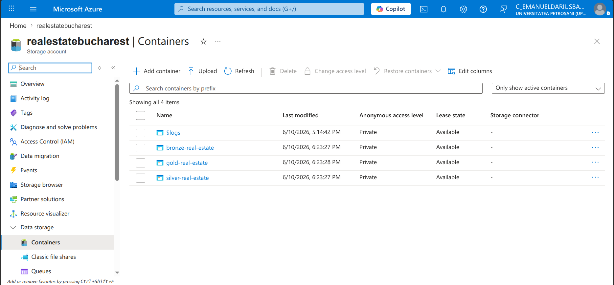
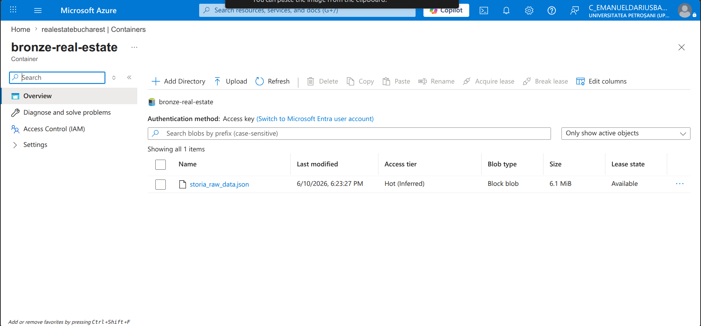
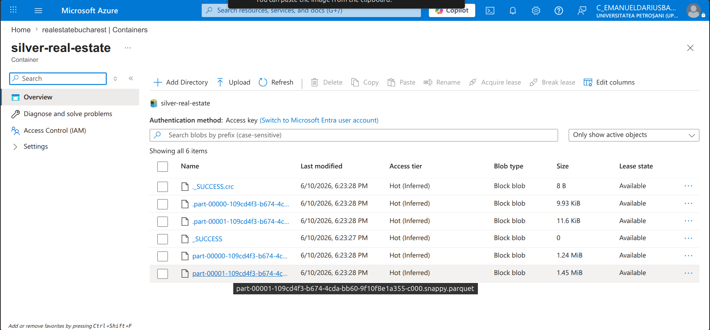
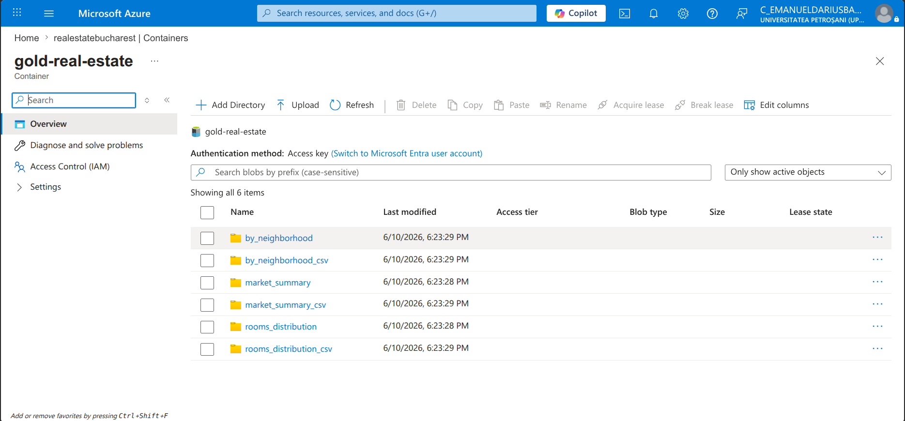

# Azure Blob Storage — Upload Architecture

This document explains the cloud storage design for the Real Estate Data Pipeline and provides evidence of a successful end-to-end upload across all three Medallion layers.

---

## Storage Architecture

Each layer of the Medallion Architecture is stored in its own dedicated Azure Blob Storage container, mirroring the logical separation of the pipeline itself.

```
Azure Storage Account: realestatebucharest
│
├── bronze-real-estate      ← Raw JSON scraped from storia.ro
├── silver-real-estate      ← Cleaned & typed Parquet (data lake pattern)
└── gold-real-estate        ← Aggregated CSV + Parquet (analytics-ready)
```

This separation ensures that each layer can be managed, versioned, and accessed independently — consistent with how production data lakes are structured on Azure Data Lake Storage Gen2.

---

## Upload Implementation

Two functions handle cloud storage in `azure_uploader.py`:

| Function | Used for | Why |
|----------|----------|-----|
| `upload_file_to_azure_blob()` | Bronze — single JSON file | Bronze is one specific file, not a folder |
| `upload_folder_to_azure()` | Silver & Gold — Parquet/CSV folders | PySpark writes multi-part files; the entire folder must be uploaded preserving its structure |

`upload_folder_to_azure()` uses `os.walk()` to traverse the directory recursively and `os.path.relpath()` to strip the local path prefix, so the blob structure in Azure mirrors the local folder structure exactly.

---

## Why Upload Calls Live in `azure_uploader.py` Only

The upload calls are intentionally kept in `azure_uploader.py` and **not** embedded inside the pipeline scripts (`01_Bronze_to_Silver.py`, `02_Silver_to_Gold.py`).

**Reasoning:**
- Pipeline scripts have a single responsibility: transform data and write to local storage
- Cloud upload is a separate concern — it should be triggered explicitly, not as a side effect of a transformation
- This makes the pipeline runnable in environments without Azure credentials (local dev, CI/CD) without any code changes
- Upload frequency may differ from pipeline frequency — e.g., upload weekly, run pipeline daily

To upload all three layers, run:
```bash
python src/cloud/azure_uploader.py
```

---

## Upload Disabled by Default

The `main()` function in `azure_uploader.py` has the upload calls **commented out** after the initial verification run. This is intentional — the pipeline runs daily via cron and uploading on every run would consume unnecessary Azure Blob Storage write operations and egress costs.

To re-enable uploads, uncomment the relevant calls in `main()`.

---

## Verified Results — Azure Portal (2026-06-10)

### All Three Containers Created



All three containers were automatically created by the upload script on first run. Access level is **Private** — data is not publicly accessible.

---

### Bronze Container — Raw Data



- **File:** `storia_raw_data.json`
- **Size:** 6.1 MiB
- **Content:** 11,239 raw listings scraped from storia.ro, stored as JSON exactly as received — no transformations applied

---

### Silver Container — Cleaned Parquet



- **Format:** Parquet with Snappy compression (`.snappy.parquet`)
- **Content:** Typed columns — `Price_EUR` (INT), `Area_sqm` (DOUBLE), `Price_per_sqm` (DOUBLE), `City_Sector`, `Neighborhood`
- **Pattern:** Multi-part files written by PySpark, consistent with Azure Data Lake Storage Gen2 production workloads

---

### Gold Container — Analytics-Ready



- **6 folders** — each Gold table stored in both Parquet and CSV format:
  - `by_neighborhood` / `by_neighborhood_csv` — average price per neighborhood
  - `rooms_distribution` / `rooms_distribution_csv` — listing count and avg price by room count
  - `market_summary` / `market_summary_csv` — single-row market-wide KPIs
- **CSV variant** included for direct consumption by BI tools without a Spark cluster
